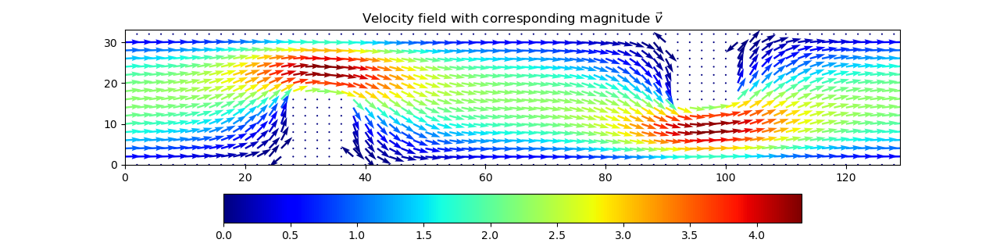

# GPU-Accelerated CFD Solver

## Overview
A high-performance computational fluid dynamics (CFD) simulation engine developed in **C++** and **CUDA**. The project simulates incompressible flow using the Navier-Stokes equations (Stream function-vorticity formulation) and models mass transport via the Advection-Diffusion equation.

The solver leverages GPU parallelism (Red-Black Gauss-Seidel relaxation) to achieve high computational efficiency, while **Python** is used for post-processing and visualization.

## Features
* **Navier-Stokes Solver:** Solves for Stream Function ($\psi$) and Vorticity ($\zeta$).
* **Mass Transport:** Simulates the advection and diffusion of a substance within the velocity field.
* **GPU Acceleration:** Custom CUDA kernels for finite difference calculations.
* **Visualization Pipeline:** Automated generation of velocity fields and transport animations using Matplotlib and FFmpeg.

## Visuals



## Requirements
* NVIDIA GPU with CUDA Toolkit installed
* `g++` / `nvcc` compiler
* Python 3.x (NumPy, Matplotlib)
* FFmpeg

## Usage
1.  **Build the project:**
    ```bash
    make
    ```
2.  **Run simulation and generate data:**
    ```bash
    ./fluid.out
    ```
3.  **Generate visualizations:**
    ```bash
    make flow.png
    make transport.mp4
    ```

## Technologies
* C++ / CUDA
* Python (NumPy, Matplotlib)
* Make